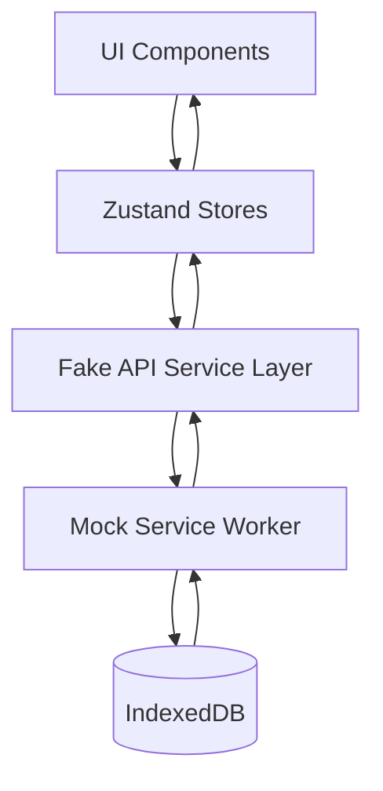

# TalentFlow - Modern Hiring Platform

A comprehensive React-based hiring platform designed for HR teams to manage the complete recruitment lifecycle. Built with modern web technologies, TalentFlow provides job management, candidate tracking, and assessment capabilities with a focus on user experience, performance, and offline-first data persistence.

##  Quick Start

### Prerequisites

- Node.js 20+ 
- npm or yarn package manager

### Installation

1. **Clone the repository**
   ```bash
   git clone https://github.com/kanakkholwal/entnt-assesment.git
   cd entnt-assesment
   ```

2. **Install dependencies**
   ```bash
   npm install
   ```

3. **Start the development server**
   ```bash
   npm run dev
   ```

4. **Open your browser**
   Navigate to `http://localhost:3000`

The application will automatically initialize with mock data including 25 jobs and 1000 candidates for testing.

## 📋 Available Scripts

| Script | Description |
|--------|-------------|
| `npm run dev` | Start development server on port 3000 |
| `npm run build` | Build for production |
| `npm run build:production` | Build with production optimizations |
| `npm run build:analyze` | Build and analyze bundle size |
| `npm run preview` | Preview production build locally |
| `npm run lint` | Run code linting |
| `npm run format` | Format code with Biome |
| `npm run check` | Run all code quality checks |

##  Architecture Overview

### TechStack

- **Frontend Framework**: React 19 with TypeScript
- **Build Tool**: Vite 6 for fast development and optimized builds
- **UI Components**: shadcn/ui with Tailwind CSS v4
- **State Management**: Zustand for lightweight, scalable state management
- **Routing**: TanStack Router with file-based routing
- **Mock API**: MSW (Mock Service Worker) for realistic API simulation
- **Local Storage**: Dexie.js for IndexedDB operations
- **Form Management**: React Hook Form with Zod validation
- **Drag & Drop**: @dnd-kit for accessible interactions
- **Virtualization**: @tanstack/react-virtual for large list performance

### Project Structure

```
src/
├── components/           # Reusable UI components
│   ├── ui/              # shadcn/ui base components
│   ├── jobs/            # Job-specific components
│   ├── candidates/      # Candidate-specific      
│   ├── assessments/     # Assessment-specific 
│   └── layout/          # Layout components
│   └── ur/              # Base components
├── routes/              # TanStack Router route 
├── stores/              # Zustand state stores
├── services/            # API service layer
├── mocks/               # MSW handlers and mock data
├── db/                  # IndexedDB schema and 
├── hooks/               # Custom React hooks
├── lib/                 # Utility functions and 
├── types/               # TypeScript type definitions
└── utils/               # Helper utilities
```

### Data Flow Architecture



##  Core Features

### 1. Job Management System
- **CRUD Operations**: Create, read, update, and archive jobs
- **Advanced Filtering**: Filter by title, status, and tags with real-time updates
- **Drag & Drop Reordering**: Intuitive job prioritization with optimistic updates
- **Deep Linking**: Direct URL access to specific jobs (`/jobs/:jobId`)
- **Server-like Pagination**: Realistic pagination controls for large datasets

### 2. Candidate Management System
- **Virtualized Lists**: Smooth performance with 1000+ candidates using virtual scrolling
- **Advanced Search**: Real-time client-side search by name and email
- **Stage Management**: Kanban board with drag-and-drop between recruitment stages
- **Candidate Profiles**: Comprehensive timeline of all status changes
- **Notes System**: Rich notes with @mentions support and local user suggestions
- **Stage Filtering**: Server-like filtering by current recruitment stage

### 3. Assessment Builder & Runtime
- **Visual Builder**: Drag-and-drop interface for creating job-specific assessments
- **Multiple Question Types**: Single-choice, multi-choice, text, numeric, and file upload
- **Conditional Logic**: Show/hide questions based on previous answers
- **Live Preview**: Real-time preview pane showing assessment as fillable form
- **Validation Rules**: Required fields, numeric ranges, and maximum length constraints


### 4. Performance & User Experience
- **Offline-First**: Full functionality without internet connection
- **Optimistic Updates**: Immediate UI feedback with rollback on API failure
- **Error Handling**: Comprehensive error boundaries with retry mechanisms
- **Loading States**: Skeleton screens and loading indicators for all async operations
- **Responsive Design**: Mobile-first design with touch-friendly interactions

##  Technical Implementation

### State Management

The application uses Zustand for state management with separate stores for different domains:

```typescript
// Jobs Store
interface JobsStore {
  jobs: Job[]
  loading: boolean
  error: string | null
  filters: JobFilters
  pagination: PaginationState
  
  // Actions
  fetchJobs: () => Promise<void>
  createJob: (job: CreateJobRequest) => Promise<void>
  updateJob: (id: string, updates: Partial<Job>) => Promise<void>
  reorderJobs: (fromOrder: number, toOrder: number) => Promise<void>
}
```

### Mock API Layer

MSW provides realistic API simulation with:
- **Artificial Latency**: 200-1200ms response times
- **Error Simulation**: 5-10% error rate for testing error handling
- **Data Persistence**: Write-through to IndexedDB for offline functionality
- **Realistic Responses**: Proper HTTP status codes and response structures

### Database Layer

Dexie.js provides TypeScript-friendly IndexedDB operations:

```typescript
class TalentFlowDB extends Dexie {
  jobs!: Table<Job>
  candidates!: Table<Candidate>
  assessments!: Table<Assessment>
  assessmentResponses!: Table<AssessmentResponse>
  timelineEvents!: Table<TimelineEvent>
}
```

### Performance Optimizations

1. **Code Splitting**: Automatic route-based code splitting
2. **Bundle Optimization**: Manual chunk splitting for vendor libraries
3. **Virtualization**: Virtual scrolling for large candidate lists
4. **Memoization**: React.memo and useMemo for expensive calculations
5. **Debounced Operations**: Search and filter operations with debouncing

##  Deployment

### Quick Deployment

1. **Build for production**
   ```bash
   npm run build:production
   ```

2. **Deploy the `dist/` folder** to any static hosting platform


**Zero Configuration Required**
- No API keys or environment variables needed
- No backend server required
- Works on any static hosting platform
- All data stored locally in browser

##  Technical Decisions

### Why These Technologies?

1. **Vite over Create React App**
   - Faster development server with HMR
   - Better build performance and optimization
   - Native TypeScript support without ejecting

2. **Zustand over Redux**
   - Smaller bundle size (2.9kb vs 47kb)
   - Less boilerplate code
   - Better TypeScript integration
   - Simpler mental model

3. **TanStack Router over React Router**
   - Type-safe routing with automatic route generation
   - Better performance with route-based code splitting
   - Built-in search params and loader support

4. **MSW over JSON Server**
   - Runs in the browser without additional server
   - Realistic network behavior simulation
   - Better error handling and edge case testing

5. **Dexie over LocalStorage**
   - Structured data storage with indexing
   - Better performance for large datasets
   - Transaction support and data integrity

6. **shadcn/ui over Material-UI**
   - Smaller bundle size with tree-shaking
   - Full customization control
   - Better accessibility out of the box
   - Modern design system

## Known Issues & Limitations

### Current Limitations

1. **Authentication System**
   - No user authentication implemented
   - All users share the same data context
   - Notes are attributed to "Current User"

2. **Real-time Collaboration**
   - No real-time updates between browser tabs
   - Changes are only reflected after page refresh

3. **File Upload Handling**
   - File upload questions in assessments are UI-only
   - No actual file storage or processing

4. **Email Integration**
   - No email notifications for candidate status changes
   - No email templates for communication

5. **Advanced Reporting**
   - No analytics or reporting dashboard
   - No export functionality for data

### Technical Debt

1. **@mentions Parsing**
   - Notes support @mentions UI but parsing is not fully implemented
   - User suggestions are hardcoded

2. **Error Recovery**
   - Some error states could have better recovery mechanisms
   - Offline/online state detection could be improved

3. **Performance Monitoring**
   - No performance metrics collection
   - Bundle size could be further optimized


### Code Style

- **TypeScript**: Strict mode enabled with comprehensive type checking
- **ESLint + Biome**: Consistent code formatting and linting
- **Conventional Commits**: Use conventional commit messages
- **Component Structure**: Follow established patterns in existing components
